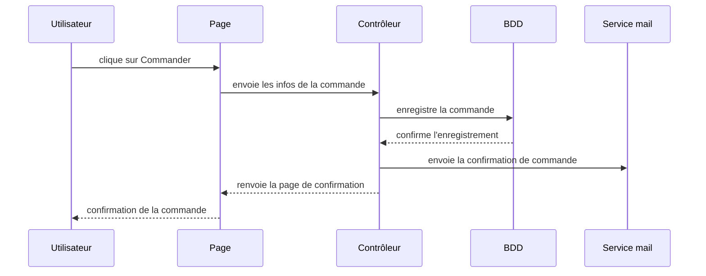

# Diagramme de séquence : passer une commande

```mermaid
sequenceDiagram
Utilisateur ->>Page : clique sur Commander
Page ->>Contrôleur : envoie les infos de la commande
Contrôleur ->>BDD : enregistre la commande
BDD -->>Contrôleur :  confirme l'enregistrement
Contrôleur ->>Service mail : envoie la confirmation de commande
Contrôleur -->>Page : renvoie la page de confirmation
Page -->>Utilisateur : confirmation de la commande
```
